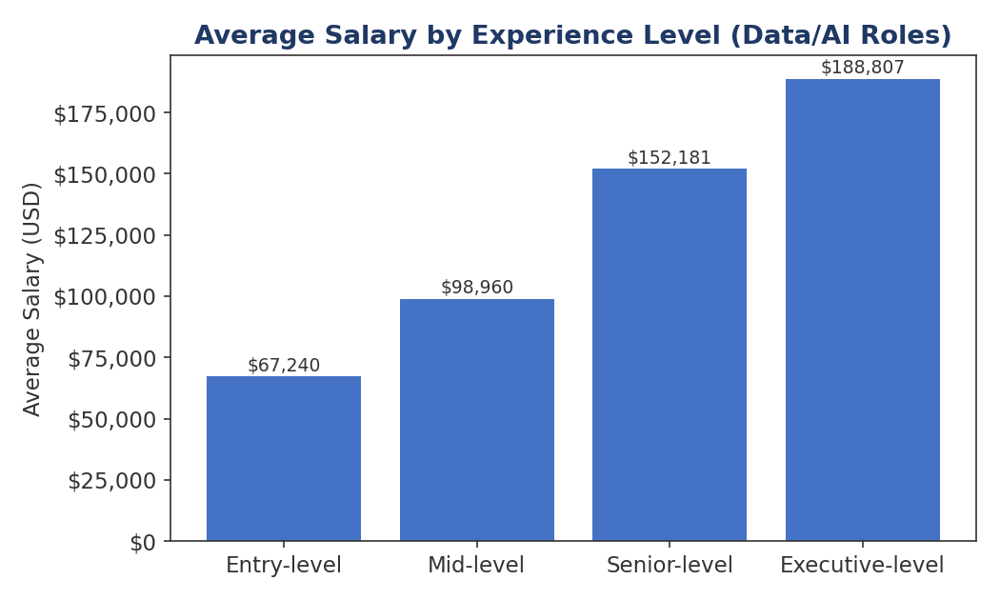
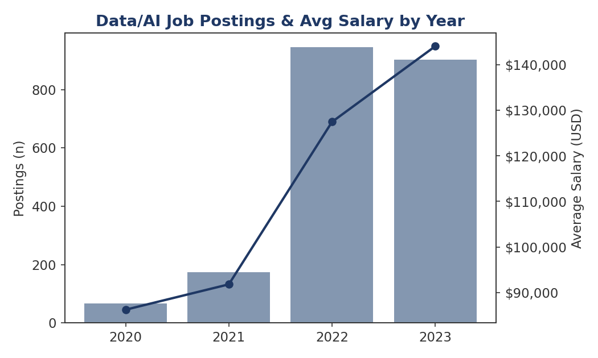
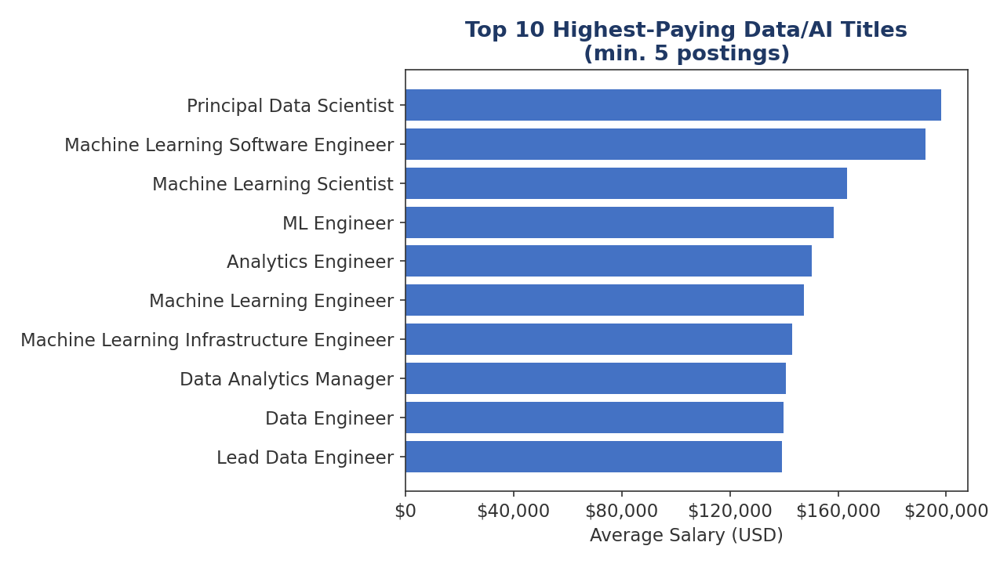
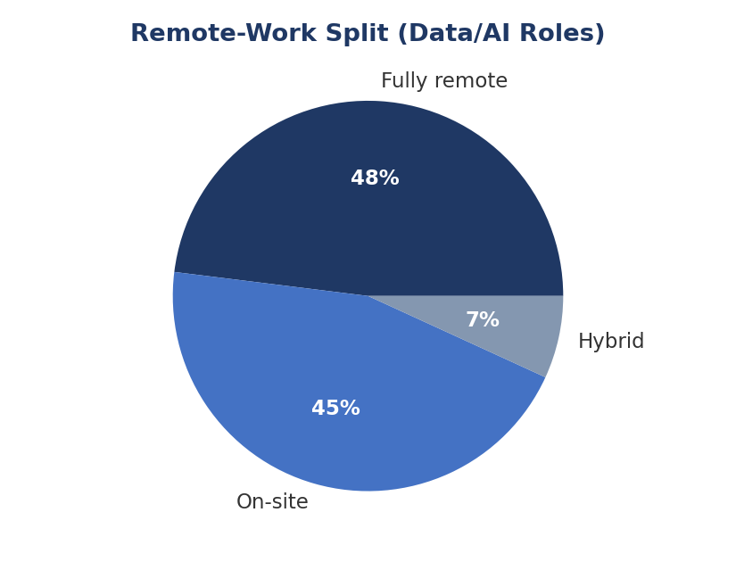
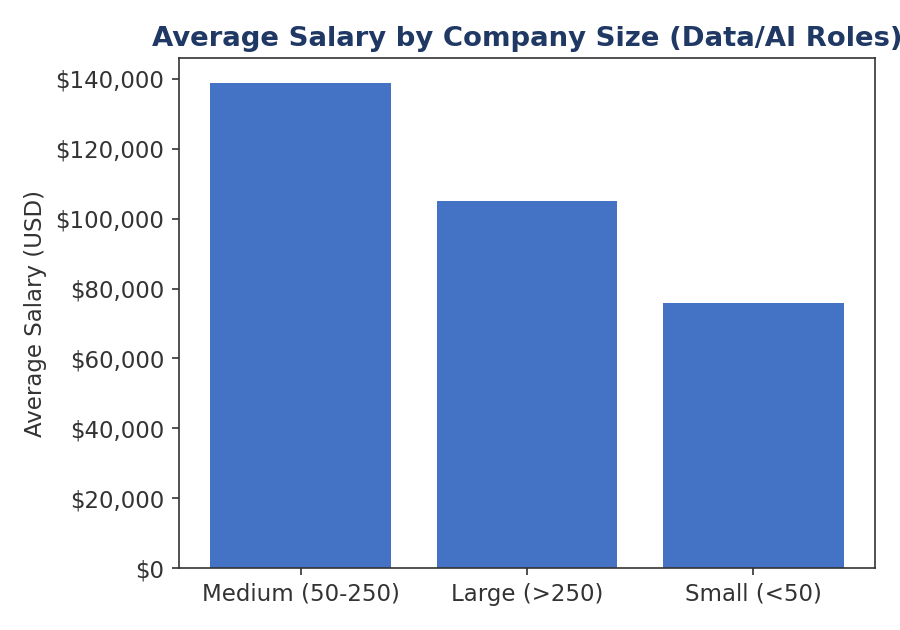
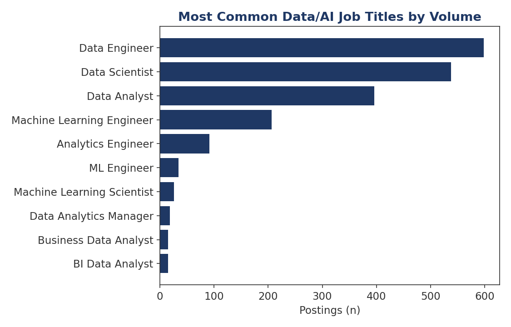

# Data & AI Job Market Salary Analysis

An end-to-end data analytics portfolio project that cleans salary data with pandas, loads it into SQLite, answers business questions with SQL, and turns the results into recruiter-friendly visual insights.

## Project highlights

- Built a repeatable ETL pipeline in Python
- Cleaned and transformed a public Data/AI salary dataset
- Loaded the prepared data into SQLite for analysis
- Wrote six SQL queries covering salary, hiring volume, remote work, company size, and job titles
- Generated six visualizations with matplotlib
- Added automated unit tests and GitHub Actions validation
- Produced a Power BI-ready cleaned CSV locally from the same pipeline

## Key findings

From the Data/AI subset analyzed in this project:

- Average salary rises from about **$67K** at entry level to about **$189K** at executive level
- Data Engineer, Data Scientist, and Data Analyst are among the highest-volume titles
- Remote work represents a substantial share of the dataset
- The analysis also compares year-over-year trends, highest-paying titles, and salary by company size

Full result tables are available in [`FINDINGS.md`](FINDINGS.md).

## Dashboard preview

| Salary by experience | Yearly trend |
| --- | --- |
|  |  |

| Highest-paying titles | Remote-work split |
| --- | --- |
|  |  |

| Salary by company size | Most common titles |
| --- | --- |
|  |  |

## Tech stack

**Python · pandas · SQL · SQLite · matplotlib · GitHub Actions**

## How the pipeline works

```text
ds_salaries.csv
      |
      v
    etl.py
      |
      +--> cleaned_salaries.csv   (generated locally)
      |
      +--> job_market.db          (generated locally)
                |
                v
           queries.sql
                |
                v
           analysis.py
                |
                +--> 6 PNG charts
                +--> FINDINGS.md
```

The generated database and cleaned CSV are intentionally not committed. They are rebuilt by the pipeline, which keeps the repository smaller and makes the workflow reproducible.

## Repository structure

```text
.
├── .github/workflows/validate.yml
├── tests/test_etl.py
├── analysis.py
├── etl.py
├── queries.sql
├── requirements.txt
├── ds_salaries.csv
├── FINDINGS.md
├── 01_avg_salary_by_experience.png
├── 02_yearly_trend.png
├── 03_top_paying_titles.png
├── 04_remote_split.png
├── 05_salary_by_company_size.png
├── 06_most_common_titles.png
└── README.md
```

## Run locally

```bash
git clone https://github.com/garvchawla775-eng/DATA-AI-JOB-MARKET-ANALYSIS.git
cd DATA-AI-JOB-MARKET-ANALYSIS

python -m venv .venv
source .venv/bin/activate      # macOS/Linux
# .venv\Scripts\activate     # Windows

pip install -r requirements.txt
python -m unittest discover -s tests -v
python etl.py
python analysis.py
```

## What each file does

- `etl.py` extracts, cleans, labels, filters, and loads the salary dataset
- `queries.sql` contains the six analytical SQL queries
- `analysis.py` runs the SQL and regenerates the charts plus `FINDINGS.md`
- `tests/test_etl.py` checks duplicate removal, category mapping, salary filtering, missing-value handling, and role classification
- `.github/workflows/validate.yml` runs tests, ETL, and analysis automatically on pushes and pull requests

## Dataset

The project uses a public Data Science / AI salary dataset covering 2020 to 2023, originally sourced from ai-jobs.net salary data.

The transformation step removes exact duplicates, drops rows missing critical analytical fields, maps coded categories to readable labels, identifies Data/AI-focused roles, and filters implausible salary values.

## Skills demonstrated

- Data cleaning and feature engineering
- ETL pipeline development
- SQL aggregation and analytical querying
- SQLite database workflows
- Data visualization
- Automated testing
- CI validation with GitHub Actions
- Communicating technical results as business insights

## Next improvements

- Build an interactive Power BI dashboard from the generated cleaned dataset
- Add geographic salary analysis
- Add forecasting for salary and hiring trends
- Replace the static source with a current job-market API
